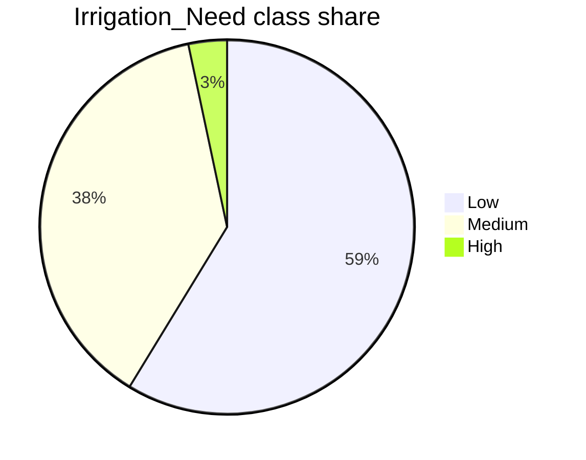
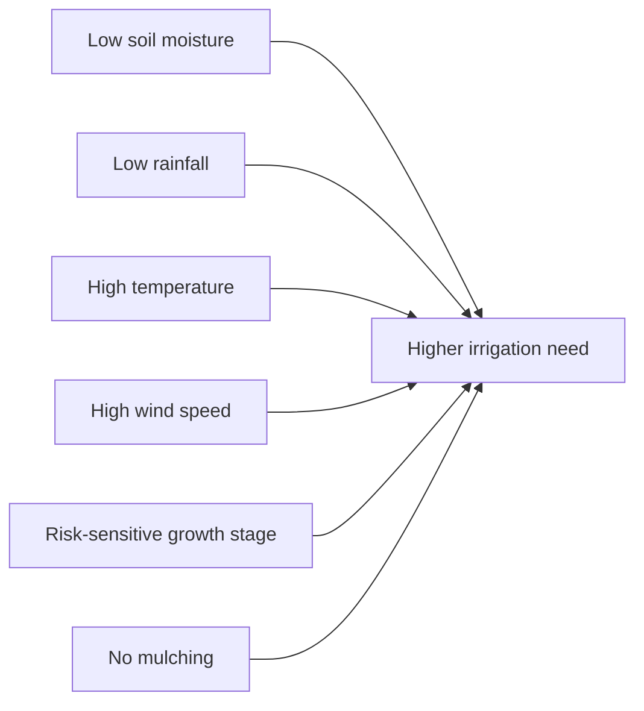

# 2. EDA Insights

## 2.1 Executive Findings

The dataset is clean and well aligned between train and test. The target is
imbalanced, with `High` irrigation need representing only `3.33%` of training
rows. The strongest visible signals are consistent with irrigation intuition:
lower soil moisture, lower rainfall, higher temperature, higher wind speed,
riskier growth stages, and no mulching are associated with greater irrigation
need.

These findings support a stratified multiclass validation strategy and a
CatBoost-first modeling approach with compact categorical interactions.

## 2.2 Dataset Quality

| Check | Finding | Modeling Implication |
| --- | --- | --- |
| Missing values | None observed | No imputation required for baseline models |
| Duplicate rows | None observed | No deduplication required |
| Duplicate IDs | None observed | Submission validation can use exact ID matching |
| Train/test drift | Very low | Standard validation should transfer reasonably |
| Feature mix | Numeric and categorical | CatBoost is a natural fit |

Train/test drift is small. The largest numeric standardized mean difference is
about `0.004`, and the largest categorical total variation distance is about
`0.0025`.

## 2.3 Target Balance

| Class | Share | Risk |
| --- | ---: | --- |
| `Low` | `58.72%` | Dominates accuracy |
| `Medium` | `37.95%` | Important middle class |
| `High` | `3.33%` | Rare and easy to under-predict |

The rare `High` class makes macro F1 and class-level recall more useful than
accuracy alone.

## 2.4 Strongest Feature Signals

The strongest drivers identified by EDA and CatBoost importance are:

1. `Soil_Moisture`
2. `Crop_Growth_Stage`
3. `Mulching_Used`
4. `Temperature_C`
5. `Wind_Speed_kmh`
6. `Rainfall_mm`
7. `Previous_Irrigation_mm`
8. `Humidity`

These variables describe the main water balance story: how much water is
already in the soil, how much water recently arrived, how quickly water is
likely being lost, and how vulnerable the crop stage is.

## 2.5 Numeric Patterns

Numeric feature distributions show meaningful target separation for water and
weather variables. The most useful numeric checks are:

- target-conditioned histograms for `Soil_Moisture`, `Rainfall_mm`,
  `Temperature_C`, `Wind_Speed_kmh`, `Previous_Irrigation_mm`, and `Humidity`;
- ordered target means from `Low` to `Medium` to `High`;
- binned target rates to reveal risk thresholds.

Observed direction of effect:

| Feature | Higher `High` Risk When |
| --- | --- |
| `Soil_Moisture` | lower |
| `Rainfall_mm` | lower |
| `Temperature_C` | higher |
| `Wind_Speed_kmh` | higher |
| `Previous_Irrigation_mm` | lower |
| `Humidity` | lower |

## 2.6 Categorical Patterns

Categorical features matter most when they interact with crop growth and water
management choices. The project keeps three compact interaction features:

| Interaction | Reason |
| --- | --- |
| `Crop_Growth_Stage` x `Mulching_Used` | Mulching can reduce water stress differently by stage |
| `Crop_Growth_Stage` x `Water_Source` | Water availability matters more in sensitive stages |
| `Crop_Growth_Stage` x `Irrigation_Type` | Delivery method can alter stage-level risk |

The interactions are simple string features so CatBoost can consume them
directly.

## 2.7 Modeling Implications

The EDA supports these modeling decisions:

1. Use stratified validation for holdout and cross-validation.
2. Track macro F1 and `High` recall alongside accuracy.
3. Use CatBoost as the main model because it handles categorical variables
   without heavy preprocessing.
4. Keep feature engineering compact and interpretable.
5. Treat train/test drift as low but continue validating submissions carefully.

## 2.8 Plot Checklist for Kaggle Reruns

The EDA notebook should regenerate the following visuals on Kaggle:

- target class distribution;
- numeric feature histograms;
- missing-value chart when missing values exist;
- numeric correlation heatmap;
- train/test distribution overlays;
- categorical target-rate summaries;
- binned numeric target-rate charts.

These plots should use the Viridis palette by default, matching
[`coding_standards.md`](coding_standards.md).
